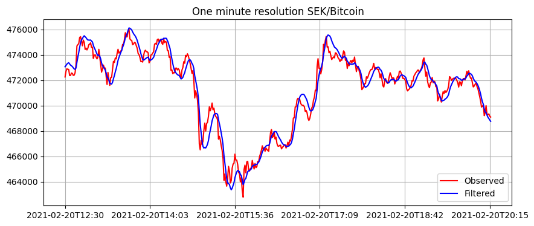
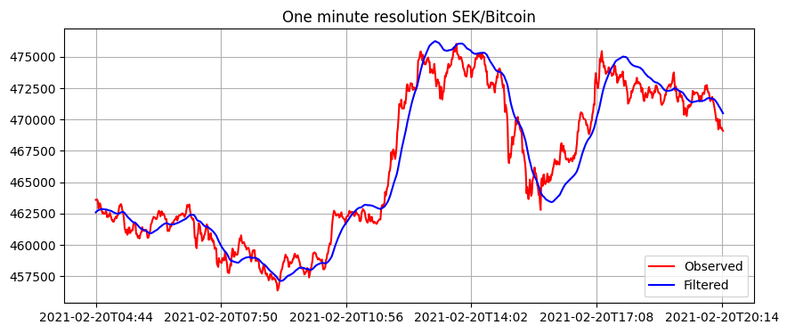
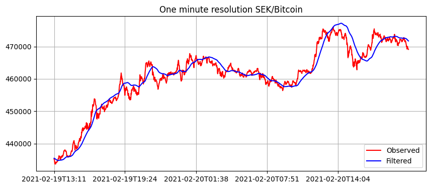
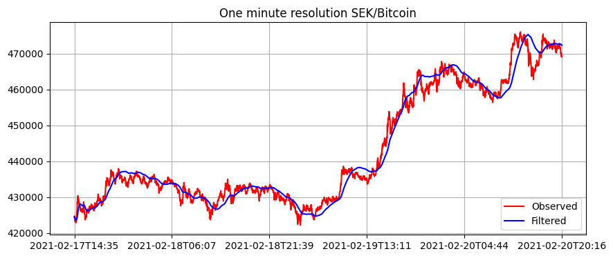

# Use

For simple testing, set up a test in `simulate_and_test.py`. Here you fake the values you want to measure (`y_true`) and add noise to them (`y_observed = y_true + noise`). You then run `y_observed` through the Kalman filter. This is neat because you can plot true/noise/filtered to see the effect of the filter.

The standard deviation doesn't really matter, the filter will converge pretty quickly.

# Filter bitcoin one minute data

Here are some different filter settings for different timespans of one minute bitcoin data. 
The filter step length is adjusted for the time range: you typically want more filtering for larger timeranges.

